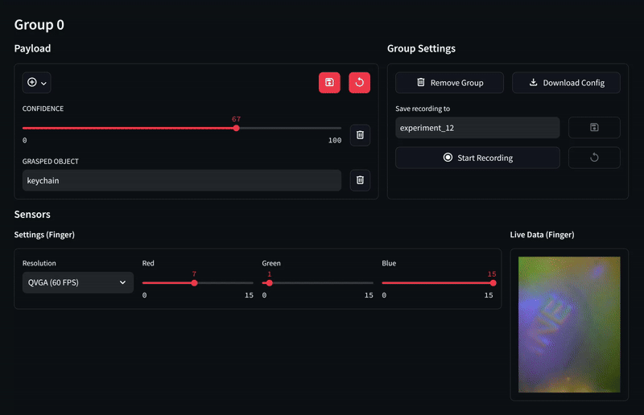

# OpenTouch Interface

A Python package designed to provide a unified interface for various touch sensors. It simplifies the process of interacting with touch sensors by providing a consistent API regardless of the specific sensor being used.

We also provide an easy-to-use web interface that lets you connect to the sensors and show their data stream without the need to code.

---

## Overview
- **Unified API**: Interact with multiple types of touch sensors using a single, consistent API.
- **Web Dashboard**: Manage sensors, record/replay data, and annotate data directly through a web interface.
- **Easy Configuration**: Use YAML config files to quickly set up and manage sensors.

**Supported sensors**:
- [Digit](https://digit.ml/)
- [Digit360](https://digit.ml/digit360.html)
- [GelSight Mini](https://www.gelsight.com/gelsightmini/)

## Installation

OpenTouch Interface requires Python 3.10+ (tested on Ubuntu 24.04).

#### Method 1: Install via `pip`

```bash
pip install opentouch-interface
```

#### Method 2: From source

```bash
git clone https://github.com/lasr-lab/opentouch-interface
cd opentouch-interface
pip install .
```

## Getting started

You can connect touch sensors to the OpenTouch Interface in two main ways:

### 1. Using the Dashboard (Web Interface)

<p align="center">

</p>

Start the dashboard. If you run into issues, try reconnecting your sensors and restarting the dashboard.
```bash
opentouch-dashboard
```

#### Adding Sensors to the Dashboard
Add sensors either by manually entering details or by providing a YAML config file. For example, your YAML might look like:
```yaml
group_name: Robotic hand  # Group name.
path: test.touch          # File path where data should be saved (optional).

sensors:      # List of sensors belonging to that group
  - ...       # Sensor 1
  - ...       # Sensor 2

payload:      # List of input elements used for data annotations (optional).
  - ...       # e.g., text input
  - ...       # e.g., slider
```
Sensors are bundled in groups. Within a group **sensor names must be unique**.
An example config file is provided as [`group.yaml`](examples/config/group.yaml). There, you also find example configs of all supported sensors.

The payload can be used for data annotations. You can find an overview of supported widgets at [`payload.md`](docs/payload.md).

### 2. Using Code

For programmatic control, please refer to the [`demo.py`](examples/record_data.py) example.
- Run with the default config ([`digit.yaml`](examples/config/digit.yaml))
    ```bash
    python examples/simple/demo.py
    ```

- Or specify a config file:
    ```bash
    python examples/simple/demo.py --config-name gelsight.yaml
    ```
---

## Contribution
We welcome contributions! Pleaes check out our [CONTRIBUTING.md](CONTRIBUTING.md) for guidelines.

---

## License

This project is licensed under the MIT License. See the [LICENSE](LICENSE) file for more details.
